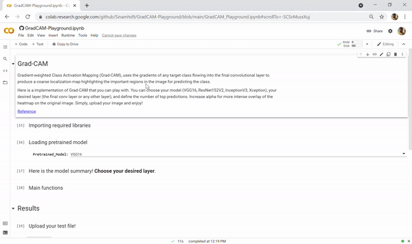
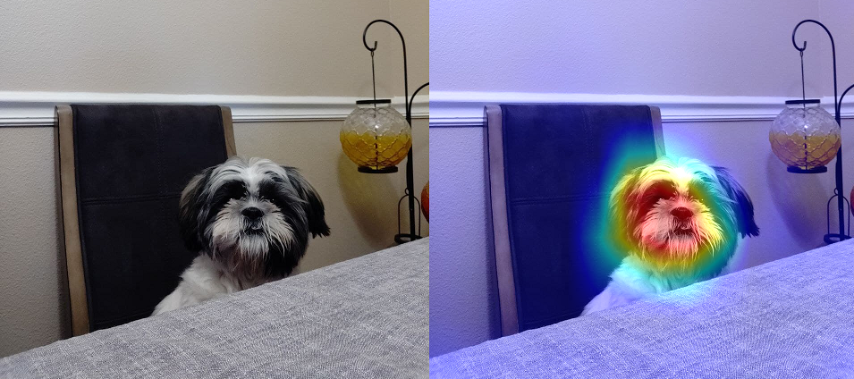

# Grad-CAM Playground
A playground implementation of GradCAM algorithm.

## Overview

Gradient-weighted Class Activation Mapping (Grad-CAM), uses the gradients of any target class flowing into the final convolutional
layer to produce a coarse localization map highlighting the
important regions in the image for predicting the class. [Reference](https://arxiv.org/pdf/1610.02391.pdf)

Here is a implementation of Grad-CAM that you can play with. You can choose your model (VGG16, ResNet152V2, InceptionV3, Xception), your desired layer (the final conv layer or any other layer), and define the number of top predictions. Increase alpha for more intense overlay of the heatmap on the original image.
Simply, open the notebook in colab, upload your image and enjoy!

